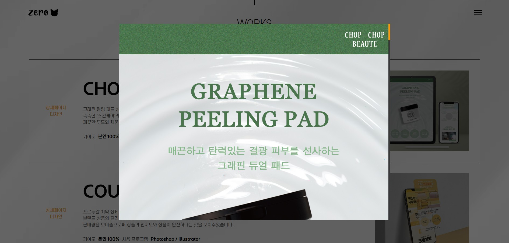
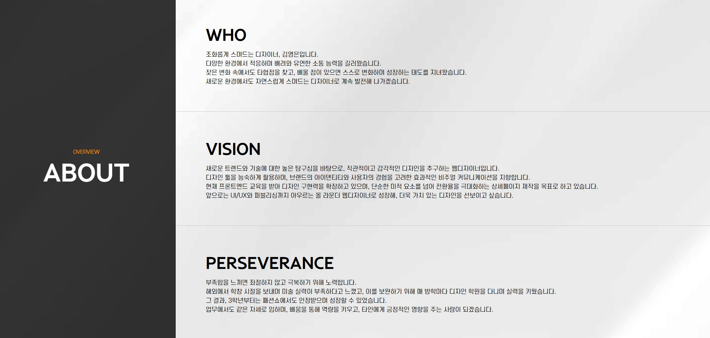

# 디자이너용 포트폴리오 웹사이트

디자이너용 포트폴리오로 제작된 웹사이트 입니다.

아래의 링크를 클릭 시, 포트폴리오 사이트로 이동됩니다.

[포트폴리오 보러가기](https://portfolio-designer-three.vercel.app/)

# 프로젝트 규모

개인 프로젝트

# 개발 기간 및 작업 관리

- 전체 개발 기간 : 2025.02.12 - 2025.02.28

- 기획 및 디자인 : 2025.02.12 - 2025.02.13

- 페이지 퍼블리싱 및 기능 구현 : 2025.02.14 - 2025.02.28

## 페이지

### 1. Home

| 메인 섹션                                 | 작업물 섹션                               | 오버뷰 섹션                               |
| ----------------------------------------- | ----------------------------------------- | ----------------------------------------- |
|  |  |  |

- 헤더의 아이콘 클릭 시, 상단으로 이동됩니다.
- 홈은 메인 섹션, 작업물 섹션, 오버뷰 섹션으로 나뉩니다.
- 메인 섹션에서 음표 아이콘을 Hover 하면 Tooltip 이 열립니다.
- 전반적으로 Scroll 할 때, 자연스러운 애니메이션이 동작되도록 구현하였습니다.

### 2. Menu

- 헤더의 메뉴 아이콘 클릭 시, 메뉴 모달창이 열립니다.
- 메뉴에서는 Home, Works, Overview 로 나뉘어져있는데, 특정 텍스트 클릭 시 해당 섹션으로 이동 되며 모달 창이 자동으로 꺼집니다.

### 3. Works

- 이미지를 Hover 하면 크기가 살짝 커집니다.
- 이미지를 클릭하면 모달창이 열리며 이미지를 원본 크기로 확인할 수 있습니다.

### 4. Overview

| About | Carrer |
|---|---|
|  |  |

| Education | Skills |
|---|---|
|  |  |
- Overview 에는 기존 이력서에 삽입되어있는 정보들이 있습니다.
- Carrer 에서 사이트 보기를 클릭하면 해당 브랜드 사이트로 이동되며, 어떤 느낌의 디자인을 해왔는지 확인 가능합니다.
- Skills 에 Icon 을 Hover 하면 Tooltip 이 나옵니다.

# 기술 스택

- Front : React, Typescript, Vite, emotion, styled-components
